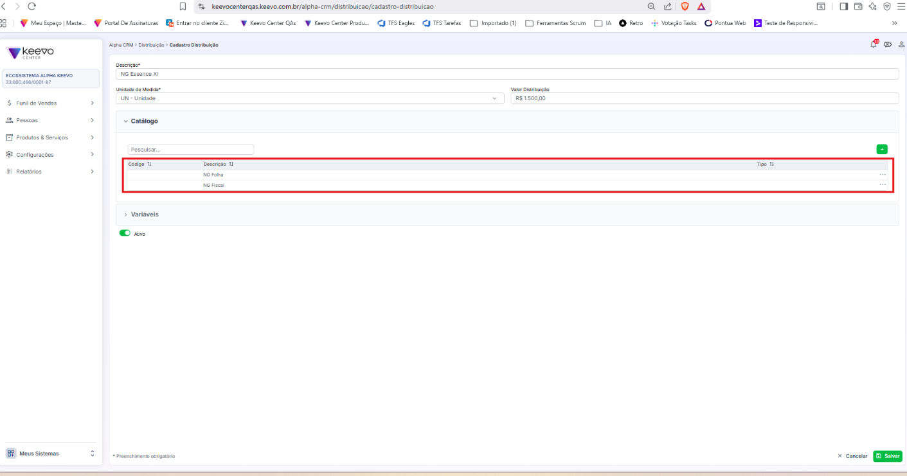

Bug Report – Falha na exibição de código e tipo na listagem de itens de distribuição

Sistema: Alpha CRM  
Ambiente: QAS  
Tipo de teste: Funcional + UI  

Impacto: Médio  

## Contexto
Durante a validação do cadastro de item de distribuição, foi identificado que a listagem do catálogo não exibe corretamente informações essenciais do item, como código e tipo, apresentando apenas a descrição.

## Cenário
- Acessar o Alpha CRM  
- Navegar até Produtos & Serviços > Distribuição  
- Acessar ou cadastrar um item de distribuição  
- Observar a listagem exibida no catálogo  

## Evidência

## Resultado atual
- Apenas a coluna de descrição é exibida (ex: "NG Folha", "NG Fiscal")
- A coluna de código não apresenta valor
- A coluna de tipo não é exibida
- A seção de variáveis não é carregada 

## Resultado esperado
- O sistema deve exibir corretamente:
  - Código  
  - Descrição  
  - Tipo  
- A seção de variáveis deve carregar corretamente
  
## Análise
Indício de falha no mapeamento dos dados no front-end ou retorno incompleto da API, impactando a renderização das colunas código e tipo.

## Sugestões de melhoria
- Validar retorno do back-end  
- Verificar mapeamento no front-end  
- Ajustar renderização da tela  
