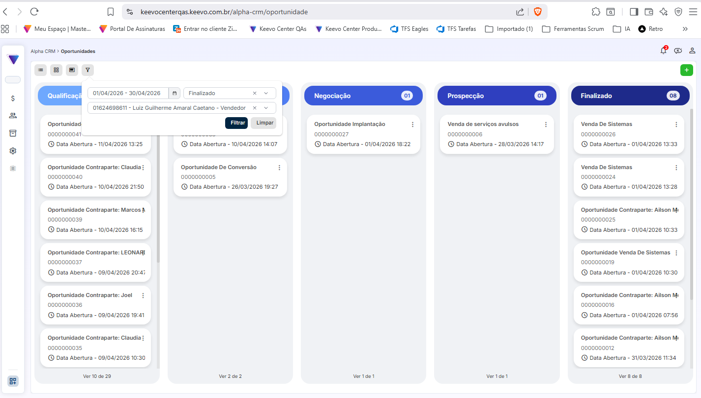

# Bug Report – Filtro não aplica corretamente na visão Kanban

Sistema: Alpha CRM  
Ambiente: QAS  
Tipo de teste: Funcional + UX  
Impacto: Médio  

---

## Contexto

Durante a validação da visualização em Kanban na tela de oportunidades, foi identificado comportamento inconsistente no uso do filtro.

Ao aplicar critérios de filtragem, o sistema não retorna corretamente os dados esperados e apresenta comportamento inesperado ao interagir com o botão de filtragem.

---

## Cenário

- Acessar o Alpha CRM  
- Navegar até a tela de Oportunidades (visão Kanban)  
- Clicar no ícone de filtro  
- Definir critérios (ex: período, status, responsável)  
- Clicar em "Filtrar"  

---

## Resultado atual

- O filtro não aplica corretamente os critérios definidos  
- Os dados exibidos não correspondem ao filtro aplicado  
- Ao clicar em "Filtrar", o modal de filtro é fechado automaticamente  
- O fechamento ocorre mesmo sem confirmação visual clara da aplicação do filtro  

---
## Evidência

---
## Resultado esperado

- O sistema deve aplicar corretamente os critérios definidos no filtro  
- Os dados exibidos devem refletir o filtro aplicado  
- O fechamento do modal deve ocorrer apenas após aplicação consistente  
- Deve haver feedback visual claro indicando que o filtro foi aplicado  

---

## Análise

Possível falha na aplicação dos parâmetros de filtro no front-end ou inconsistência no envio/retorno dos dados do back-end.

O comportamento de fechamento do modal pode indicar execução parcial da ação sem atualização correta da tela.

---

## Sugestões de melhoria

- Validar aplicação dos parâmetros de filtro no front-end  
- Garantir consistência no retorno da API  
- Exibir feedback visual ao usuário após aplicação do filtro  
- Avaliar necessidade de manter o modal aberto até confirmação visual dos dados filtrados  

---

